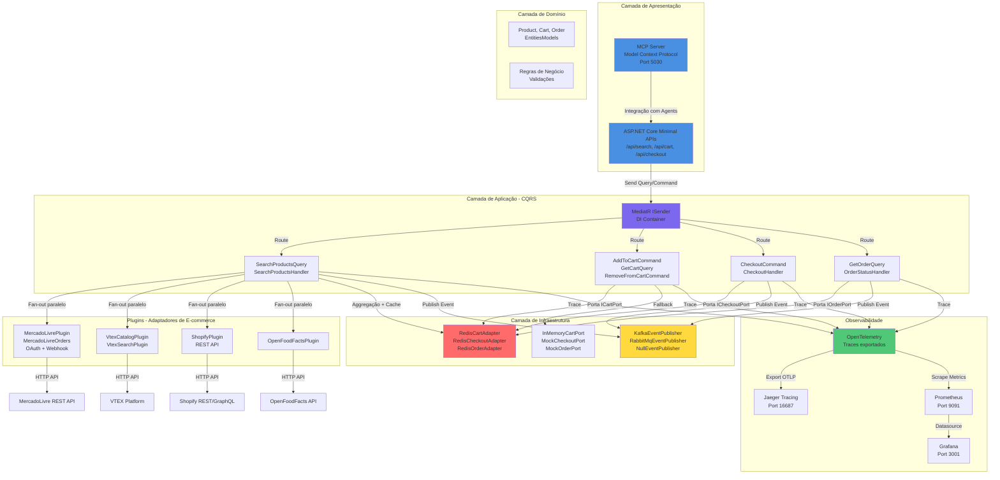

# Comprai — Plataforma de Comércio Agêntico baseada em UCP

Comprai é um ecossistema modular open-source que implementa o **Universal Commerce Protocol (UCP)** no Brasil. Plugins de catálogo, canais de atendimento, agentes de IA, monitoramento de preços e pagamentos funcionam juntos ou separadamente — permitindo que qualquer superfície (chat, browser, WhatsApp, Teams) execute o fluxo completo de compras de forma autônoma.

> 📋 Veja o histórico completo de versões em [CHANGELOG.md](CHANGELOG.md)

---

## 📑 Índice

- [🌐 Universal Commerce Protocol (UCP)](#-universal-commerce-protocol-ucp)
- [🏗️ Arquitetura do Sistema](#%EF%B8%8F-arquitetura-do-sistema)
- [🧩 Componentes e Camadas](#-componentes-e-camadas)
- [📁 Estrutura do Projeto](#-estrutura-do-projeto)
- [🔄 Fluxo de Execução](#-fluxo-de-execução)
- [🚀 Stack Tecnológica](#-stack-tecnológica)
- [▶️ Como Rodar](#%EF%B8%8F-como-rodar)
- [🧪 Testes](#-testes)
- [⚙️ Variáveis de Ambiente](#%EF%B8%8F-variáveis-de-ambiente)
- [📊 Portais de Observabilidade](#-portais-de-observabilidade)
- [🔁 CI/CD Pipeline](#-cicd-pipeline)
- [🗺️ Roadmap](#%EF%B8%8F-roadmap)
- [📄 Licença](#-licença)

---

## 🌐 Universal Commerce Protocol (UCP)

O **Comprai** é construído sobre o **Universal Commerce Protocol (UCP)**, um padrão aberto lançado pelo Google em janeiro de 2026, co-desenvolvido com a Shopify e endossado por mais de 20 empresas globais — incluindo Visa, Mastercard, Stripe, Walmart, Target e Best Buy.

> 💡 O Brasil ainda não tem nenhuma implementação pública do UCP.
> O Comprai é uma das primeiras referências nacionais do protocolo.

<details>
<summary>❓ O problema que o UCP resolve</summary>

O comércio digital atual é fragmentado: cada loja tem sua própria API, seu próprio carrinho, seu próprio fluxo de checkout. Quando um agente de IA tenta comprar algo em nome do usuário, ele precisa entender o idioma específico de cada plataforma — tornando a integração complexa, frágil e impossível de escalar.

O UCP resolve isso definindo uma **linguagem comum e primitivas funcionais** para que qualquer agente, plataforma ou provedor de pagamento consiga interagir com qualquer loja de forma padronizada e segura — da descoberta do produto ao pós-venda.

</details>

<details>
<summary>⚙️ Como funciona</summary>

O protocolo define quatro operações centrais:

| Operação | Descrição |
|----------|-----------|
| **Search / Catalog** | Busca e descoberta de produtos em tempo real com variantes, estoque e preço |
| **Cart** | Adição de múltiplos produtos de múltiplos lojistas em um único carrinho unificado |
| **Checkout** | Sessão de checkout segura, com ou sem intervenção humana |
| **Order** | Rastreamento de status, entrega e devoluções via webhooks |

O UCP é **agnóstico de transporte** — funciona via REST, MCP (Model Context Protocol) ou A2A (Agent-to-Agent), e é compatível com o Agent Payments Protocol (AP2) para pagamentos seguros.

</details>

<details>
<summary>🏢 Quem já está usando</summary>

| Empresa | Papel |
|---------|-------|
| **Google** | Criador — integrado ao AI Mode, Gemini e YouTube Shopping |
| **Shopify** | Co-desenvolvedor — suporte nativo ativo para todos os merchants |
| **Stripe** | Membro do UCP Tech Council — payment handler oficial publicado |
| **Salesforce / Commerce Inc.** | Implementação anunciada para 2026 |
| **Etsy, Wayfair, Target, Walmart** | Parceiros fundadores |

</details>

<details>
<summary>📚 Referências</summary>

- 📄 [Especificação oficial — ucp.dev](https://ucp.dev)
- 🐙 [Repositório GitHub — Universal-Commerce-Protocol/ucp](https://github.com/Universal-Commerce-Protocol/ucp)
- 📝 [Google Developers Blog — Under the Hood: UCP (jan/2026)](https://developers.googleblog.com/under-the-hood-universal-commerce-protocol-ucp/)
- 🛍️ [Google Blog — New tech and tools for retailers (jan/2026)](https://blog.google/products/ads-commerce/agentic-commerce-ai-tools-protocol-retailers-platforms/)
- 🔄 [Google Blog — UCP updates: Cart, Catalog, Identity Linking (mar/2026)](https://blog.google/products-and-platforms/products/shopping/ucp-updates/)
- 🏗️ [Shopify Engineering — Building the Universal Commerce Protocol](https://shopify.engineering/ucp)
- 💳 [Stripe — UCP Protocol & Payment Handlers](https://docs.stripe.com/agentic-commerce/protocol.md)

</details>

---

## 🏗️ Arquitetura do Sistema

O Comprai implementa uma arquitetura de **Portas e Adaptadores** (Hexagonal) com separação clara de responsabilidades:

- **Camada de Apresentação:** ASP.NET Core Minimal APIs + MCP Server
- **Camada de Aplicação:** MediatR (CQRS) com Queries e Commands
- **Camada de Domínio:** Entidades e regras de negócio
- **Camada de Infraestrutura:** Implementações de portas (Redis, Kafka, Plugins)
- **Plugins:** Adaptadores para e-commerces externos (MercadoLivre, Shopify, VTEX, etc.)

<details>
<summary>📐 Ver Diagrama Funcional</summary>



</details>

---

## 🧩 Componentes e Camadas

<details>
<summary>📋 Ver tabela completa de camadas e responsabilidades</summary>

| **Camada** | **Componente** | **Tecnologia** | **Objetivo** | **Exemplos** |
|---|---|---|---|---|
| **Apresentação** | ASP.NET Core Minimal APIs | .NET 10 + Scalar OpenAPI | Expor endpoints HTTP REST | `GET /api/search`, `POST /api/cart/{sessionId}/items` |
| **Apresentação** | MCP Server | Model Context Protocol | Interface padrão para agentes de IA e LLMs | Expor operações de compra como tools para Claude/OpenAI |
| **Aplicação** | MediatR Handlers | MediatR CQRS | Orquestração de lógica de negócio | `SearchProductsHandler`, `AddToCartCommandHandler` |
| **Aplicação** | Queries & Commands | DTOs + Records | Definição estruturada de entrada/saída | `SearchProductsQuery`, `AddToCartCommand` |
| **Domínio** | Entities & Value Objects | C# Records | Representação imutável de conceitos do negócio | `Product`, `CartItem`, `Order`, `Customer` |
| **Domínio** | Domain Events | Events | Eventos emitidos após transações | `ProductSearchedEvent`, `OrderCreatedEvent` |
| **Infraestrutura** | Portas (Interfaces) | SharedKernel | Contrato abstrato entre camadas | `IProductCatalogPort`, `ICartPort`, `ICheckoutPort` |
| **Infraestrutura** | Redis Adapters | StackExchange.Redis | Persistência e cache de cart/checkout/orders | `RedisCartAdapter`, `RedisCheckoutAdapter` |
| **Infraestrutura** | In-Memory Adapters | Collections .NET | Fallback para dev/testes sem banco externo | `InMemoryCartPort`, `MockCheckoutPort` |
| **Infraestrutura** | Event Publishers | Kafka / RabbitMQ / Null | Pub/sub de eventos assíncronos | `KafkaEventPublisher`, `RabbitMqEventPublisher` |
| **Infraestrutura** | HybridCache | Redis + L1 Local | Cache L1/L2 para buscas federadas (TTL 5min) | Resultado de `/api/search?q=notebook` |
| **Plugins** | Catalog Plugins | HTTP Clients | Implementações de `IProductCatalogPort` | `MercadoLivrePlugin`, `ShopifyPlugin`, `VtexCatalogPlugin` |
| **Observabilidade** | OpenTelemetry | OTel SDK | Instrumentação de traces distribuídos | Traces de cada Query/Command |
| **Observabilidade** | Jaeger + Prometheus + Grafana + Loki | Docker | Visualização de traces, métricas e logs | Ports 16687, 9091, 3001, 3101 |

</details>

<details>
<summary>🎨 Camada de Apresentação</summary>

**ASP.NET Core Minimal APIs** — Roteamento HTTP simples e declarativo:
- `/api/search` → `GET` com cache 5min
- `/api/cart/{sessionId}` → `GET`, `POST /items`, `DELETE /items/{itemId}`
- `/api/checkout/{sessionId}` → `POST`
- `/api/orders/{orderId}` → `GET`
- `/api/ml/*` → OAuth + webhooks MercadoLivre

**MCP Server** — Expõe operações como "tools" para agentes de IA (OpenAI, Anthropic). Roda na porta 5030 isolada.

</details>

<details>
<summary>🔄 Camada de Aplicação (CQRS)</summary>

**Queries (Leitura):**
- `SearchProductsQuery` → Handler faz fan-out paralelo para todos os plugins
- `GetCartQuery` → Recupera itens da sessão
- `GetOrderQuery` → Busca status de pedido

**Commands (Escrita):**
- `AddToCartCommand` → Adiciona/atualiza item no carrinho
- `RemoveFromCartCommand` → Remove item do carrinho
- `CheckoutCommand` → Finaliza pedido, persiste em Redis

Cada handler valida, executa lógica, publica evento e retorna `Result<T>`.

</details>

<details>
<summary>🔌 Camada de Plugins</summary>

Cada plugin implementa `IProductCatalogPort`. Fan-out paralelo via `Task.WhenAll` — falha isolada por plugin, agregação e deduplicação por `(Source:Id)`.

| Plugin | API | Auth | Recursos |
|---|---|---|---|
| **MercadoLivrePlugin** | REST | Público | Busca por texto, fan-out eficiente |
| **MercadoLivreOrders** | REST + Webhooks | OAuth 2.0 | Listar/buscar pedidos, notificações |
| **ShopifyPlugin** | GraphQL Admin | Access Token | Busca com Admin API 2024-10 |
| **VtexCatalogPlugin** | REST | API Key | Catálogo completo |
| **VtexSearchPlugin** | REST | API Key | Busca com filtros avançados |
| **OpenFoodFactsPlugin** | REST | Público | Base de dados de alimentos |
| **DummyJsonPlugin** | REST | Público | 190+ produtos reais sem auth (dev) |

</details>

<details>
<summary>🔧 Portas (Interfaces SharedKernel)</summary>

```csharp
IProductCatalogPort      // Busca de produtos (implementado por plugins)
ICartPort                // Persistência de carrinho
ICheckoutPort            // Persistência de checkout
IOrderPort               // Persistência de pedidos
IEventPublisher          // Publicação de eventos
IIntentRouterService     // Roteamento de intenções conversacionais
```

**Redis Adapters** — TTL 72h para cart, chaves no padrão `cart:{sessionId}`, `order:session:{sessionId}`.

**Event Publishers** — Kafka (tópicos auto-criados), RabbitMQ (exchanges/queues), NullEventPublisher (dev/no-op).

</details>

---

## 📁 Estrutura do Projeto

<details>
<summary>📂 Ver estrutura completa</summary>

```
src/
  UcpAgent.SharedKernel/       Tipos compartilhados, interfaces de porta
  UcpAgent.Domain/             Entidades de domínio e regras de negócio
  UcpAgent.Application/        Casos de uso — MediatR Handlers
    └─ Search/                 SearchProductsQuery + Handler (fan-out para todos os plugins)
    └─ Cart/                   AddToCartCommand, RemoveFromCartCommand, GetCartQuery
    └─ Checkout/               CheckoutCommand
    └─ Orders/                 GetOrderQuery, GetOrderBySessionQuery
  UcpAgent.Infrastructure/     Implementações concretas de portas
    └─ Cart/                   RedisCartAdapter, InMemoryCartPort
    └─ Checkout/               RedisCheckoutAdapter, MockCheckoutPort
    └─ Orders/                 RedisOrderAdapter, MockOrderPort
    └─ Messaging/              KafkaEventPublisher, RabbitMqEventPublisher, NullEventPublisher
  UcpAgent.Api/                ASP.NET Core host
    └─ Program.cs              Setup DI, endpoints (Minimal APIs + MediatR)
    └─ Endpoints/              Mappers de rotas
    └─ Mocks/                  MockCatalogPlugin, MockCartPort, etc.
    └─ Models/                 DTOs
  UcpAgent.McpServer/          Model Context Protocol Server
  UcpAgent.FakeCatalog/        Gerador de catálogo com Bogus BR + exportadores multi-plataforma
  UcpAgent.PriceWatcher/       BackgroundService + SignalR Hub para monitoramento de preços

plugins/
  ├─ UcpAgent.Catalog.MercadoLivre
  ├─ UcpAgent.Catalog.MercadoLivreOrders
  ├─ UcpAgent.Catalog.VtexCatalog
  ├─ UcpAgent.Catalog.VtexSearch
  ├─ UcpAgent.Catalog.OpenFoodFacts
  ├─ UcpAgent.Catalog.Shopify
  └─ UcpAgent.Catalog.DummyJSON

tests/
  ├─ UcpAgent.Domain.Tests
  ├─ UcpAgent.Application.Tests
  ├─ UcpAgent.Catalog.MercadoLivre.Tests
  └─ UcpAgent.Integration.Tests       Testes E2E com CompraApiFactory (fluxo completo)

.github/workflows/
  └─ ci-cd.yml                        Pipeline: unit-tests → integration-tests → deploy → smoke-tests

deploy/
  └─ docker-compose.yml               Produção com healthchecks, volumes e profiles

newman/
  └─ comprai-smoke.json               Testes E2E pós-deploy: search → cart → checkout → orders
```

</details>

---

## 🔄 Fluxo de Execução

<details>
<summary>🔍 Busca de Produtos (Search Flow)</summary>

```
GET /api/search?q=notebook
  ↓
ASP.NET Core Route Handler
  ↓
IMediator.Send(SearchProductsQuery)
  ↓
SearchProductsHandler
  ├─ Paralelo: MercadoLivrePlugin.SearchAsync()
  ├─ Paralelo: ShopifyPlugin.SearchAsync()
  ├─ Paralelo: VtexCatalogPlugin.SearchAsync()
  └─ Paralelo: OpenFoodFactsPlugin.SearchAsync()
  ↓
Agregação + Deduplicação (Source:Id)
  ↓
Ranking (disponibilidade > preço)
  ↓
HybridCache (TTL 5min)
  ↓
Result<SearchResult> retorna ao cliente
```

</details>

<details>
<summary>🛒 Carrinho e Checkout (Cart/Checkout Flow)</summary>

```
POST /api/cart/{sessionId}/items
  ↓
AddToCartCommand
  ↓
ICartPort.AddItemAsync()
  → RedisCartAdapter (produção)
  → InMemoryCartPort (dev/testes)
  ↓
CartItemAdded Event Published
  ↓
POST /api/checkout/{sessionId}
  ↓
CheckoutCommand
  ↓
ICheckoutPort.ExecuteAsync()
  ↓
Order criada e persistida
  ↓
IEventPublisher.PublishAsync(OrderCreatedEvent)
  ↓
Kafka/RabbitMQ recebe evento (fulfillment, etc.)
```

</details>

<details>
<summary>📦 Rastreamento de Pedidos (Orders Flow)</summary>

```
MercadoLivre Webhook → /webhook/ml
  ↓
MlWebhookService.ProcessAsync()
  ↓
Order status atualizado no Redis
  ↓
OrderStatusChangedEvent publicado
  ↓
GET /api/orders/{orderId} retorna status atualizado
```

</details>

---

## 🚀 Stack Tecnológica

| Categoria | Tecnologia |
|---|---|
| **Linguagem / Runtime** | C# (.NET 10), ASP.NET Core Minimal APIs |
| **Padrões** | Clean Architecture (Hexagonal), DDD, CQRS (MediatR) |
| **Cache** | HybridCache (.NET 10) + Redis (StackExchange.Redis) |
| **Mensageria** | Kafka, RabbitMQ (switcháveis via feature flag) |
| **Observabilidade** | OpenTelemetry + Jaeger + Prometheus + Grafana + Loki |
| **Testes** | xUnit, Moq, CompraApiFactory, Newman (smoke E2E) |
| **CI/CD** | GitHub Actions (4 jobs), Docker, appleboy/ssh-action |
| **Protocolos** | UCP (Universal Commerce Protocol), MCP (Model Context Protocol) |

---

## ▶️ Como Rodar

<details>
<summary>💻 Desenvolvimento Local com Mocks</summary>

```bash
git clone https://github.com/josehelioaraujo/comprai.git
cd comprai
dotnet restore comprai.sln
dotnet build src/UcpAgent.Api/UcpAgent.Api.csproj
dotnet run --project src/UcpAgent.Api
# Acessa http://localhost:5020/scalar
```

</details>

<details>
<summary>🐳 Com Docker (Recomendado)</summary>

```bash
# Desenvolvimento
docker compose up -d comprai-api comprai-mcp redis

# Verificar saúde
curl http://localhost:5020/health/live
curl http://localhost:5020/health/ready

# Produção completa
cd deploy && docker compose up -d

# Com observabilidade
docker compose --profile monitoring up -d

# Com Kafka
docker compose --profile kafka up -d
```

</details>

---

## 🧪 Testes

<details>
<summary>Ver comandos de teste</summary>

```bash
# Unitários
dotnet test tests/UcpAgent.Domain.Tests
dotnet test tests/UcpAgent.Application.Tests
dotnet test tests/UcpAgent.Catalog.MercadoLivre.Tests

# Integração (requer env vars)
export ML_ACCESS_TOKEN=xxx
export SHOPIFY_ACCESS_TOKEN=yyy
dotnet test tests/UcpAgent.Integration.Tests

# Smoke tests E2E pós-deploy
newman run newman/comprai-smoke.json \
  --env-var baseUrl=http://localhost:5020 \
  --env-var mcpUrl=http://localhost:5030
```

</details>

---

## ⚙️ Variáveis de Ambiente

<details>
<summary>Ver todas as variáveis</summary>

| Var | Padrão | Descrição |
|---|---|---|
| `ASPNETCORE_ENVIRONMENT` | `Production` | ASP.NET environment |
| `Features__UsarMockDados` | `false` | Usar mocks em vez de APIs reais |
| `Features__UsarRedis` | `true` | Usar Redis para cart/checkout/orders |
| `Features__UsarKafka` | `false` | Usar Kafka para pub/sub de eventos |
| `Features__UsarRabbitMQ` | `false` | Usar RabbitMQ para pub/sub de eventos |
| `Redis__ConnectionString` | `localhost:6379` | Conexão Redis |
| `Kafka__BootstrapServers` | `localhost:9092` | Bootstrap Kafka |
| `RabbitMQ__Host` | `localhost` | Host RabbitMQ |
| `MercadoLivre__AccessToken` | N/A | Token OAuth ML |
| `Shopify__AccessToken` | N/A | Token de acesso Shopify |
| `OTEL_EXPORTER_OTLP_ENDPOINT` | `http://localhost:4317` | Endpoint Jaeger OTLP |
| `ML_SKIP_TOKEN_TEST` | `false` | Skip testes que precisam token ML |

</details>

---

## 📊 Portais de Observabilidade

| Serviço | URL | Credenciais |
|---|---|---|
| **API** | http://localhost:5020 | N/A |
| **MCP Server** | http://localhost:5030 | N/A |
| **OpenAPI (Scalar)** | http://localhost:5020/scalar | N/A |
| **Jaeger Tracing** | http://localhost:16687 | N/A |
| **Prometheus** | http://localhost:9091 | N/A |
| **Grafana** | http://localhost:3001 | admin / admin |
| **Loki Logs** | http://localhost:3101 | N/A |
| **Redis Commander** | http://localhost:8084 | N/A |
| **Kafka UI** | http://localhost:8083 | N/A |
| **RabbitMQ Manager** | http://localhost:15673 | guest / guest |

---

## 🔁 CI/CD Pipeline

<details>
<summary>Ver detalhes do pipeline</summary>

Workflow em `.github/workflows/ci-cd.yml` com 4 jobs sequenciais:

1. **unit-tests** — Build + testes de Domain, Application, Infrastructure, Api
2. **integration-tests** — Testes E2E com env vars de ML/Shopify
3. **deploy** — SSH na VPS (Hostinger KVM2), pull + docker compose up
4. **smoke-tests** — Newman valida o fluxo completo pós-deploy

**Feature flags no workflow:**
- `broker`: Escolher message broker (nenhum, kafka, rabbitmq)
- `usar_banco`: Ativar Redis em produção

</details>

---

## 🗺️ Roadmap

<details>
<summary>Ver próximas fases</summary>

| Fase | Descrição | Status |
|---|---|---|
| **IPaymentPort** | MockPayment + Stripe + MercadoPago — fecha o fluxo UCP end-to-end | 🔜 V009 |
| **ILlmPort** | Intent Router em linguagem natural com Ollama (Gemma 2 PT-BR) | 🔜 V009 |
| **Canal WhatsApp** | Evolution API self-hosted na VPS — compra por mensagem | 🔜 V009 |
| **Extensão Chrome** | Price Watcher, Universal Cart e Intent Bar nativos no browser | 🔜 Futuro |
| **Canal Web** | Next.js 15 + shadcn/ui — painel admin + storefront UCP | 🔜 Futuro |
| **Canal Teams** | Bot Framework SDK | 🔜 Futuro |
| **OBSVIEW** | Status Page dedicada (FastAPI + React) | 🔜 Futuro |

</details>

---

## 📄 Licença

MIT License — veja [LICENSE](LICENSE) para detalhes.

**Autor:** [@josehelioaraujo](https://github.com/josehelioaraujo)

Para dúvidas, issues ou contribuições, abra uma issue ou pull request no repositório.
