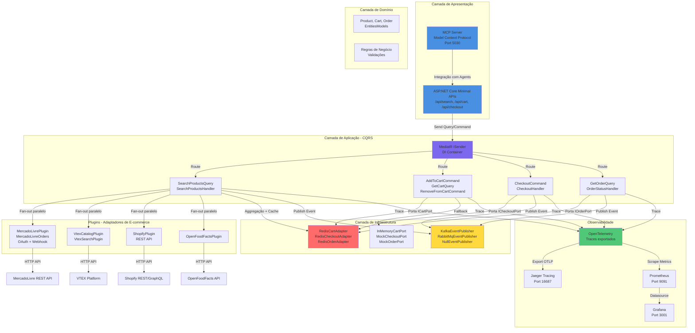

# Comprai — Agente de IA para Compras multi-canal

Comprai é um agente de IA para compras baseado no **Universal Commerce Protocol (UCP)** que integra múltiplos e-commerces (MercadoLivre, Shopify, VTEX, OpenFoodFacts) através de plugins plugáveis. Oferece uma interface conversacional (via MCP Server) e suporta operações multi-canal: busca federada de produtos, carrinho, checkout e rastreamento de pedidos com rastreabilidade OAuth.

## Stack

- **Linguagem:** C# (.NET 10)
- **Framework / runtime:** ASP.NET Core 10 + MediatR (CQRS) + HybridCache (Redis)
- **Padrões:** Clean Architecture (Ports & Adapters), Domain-Driven Design
- **Observabilidade:** OpenTelemetry + Jaeger + Prometheus + Grafana + Loki
- **Notáveis:** StackExchange.Redis, Kafka, RabbitMQ (switcháveis), Shopify/MercadoLivre SDKs

---

## Arquitetura do Sistema

### Visão Geral

Comprai implementa uma arquitetura de **Portas e Adaptadores** (Hexagonal) com separação clara de responsabilidades:

- **Camada de Apresentação:** ASP.NET Core Minimal APIs + MCP Server
- **Camada de Aplicação:** MediatR (CQRS) com Queries e Commands
- **Camada de Domínio:** Entidades e regras de negócio
- **Camada de Infraestrutura:** Implementações de portas (Redis, Kafka, Plugins)
- **Plugins:** Adaptadores para e-commerces externos (MercadoLivre, Shopify, VTEX, etc.)

### Diagrama Funcional



---

## Componentes / Camadas

### Tabela de Camadas e Responsabilidades

| **Camada** | **Componente** | **Tecnologia** | **Objetivo** | **Exemplos** |
|---|---|---|---|---|
| **Apresentação** | ASP.NET Core Minimal APIs | .NET 10 + Scalar OpenAPI | Expor endpoints HTTP REST para consumo direto ou via UI | `GET /api/search`, `POST /api/cart/{sessionId}/items`, `POST /api/checkout/{sessionId}` |
| **Apresentação** | MCP Server | Model Context Protocol | Interface padrão para integração com agentes de IA e LLMs | Expor operações de compra como tools para Claude/OpenAI |
| **Aplicação** | MediatR Handlers | MediatR CQRS | Orquestração de lógica de negócio via Command/Query Pattern | `SearchProductsHandler`, `AddToCartCommandHandler`, `CheckoutCommandHandler` |
| **Aplicação** | Services | Interfaces Tipadas | Abstração de processos multi-etapa com tipos concretos | `ISearchService`, `ICartService`, `ICheckoutService`, `IOrderService` |
| **Aplicação** | Queries & Commands | DTOs + Records | Definição estruturada de entrada/saída | `SearchProductsQuery`, `AddToCartCommand`, `CheckoutCommand` |
| **Domínio** | Entities & Value Objects | C# Records | Representação imutável de conceitos do negócio | `Product`, `CartItem`, `Order`, `Customer` |
| **Domínio** | Domain Events | Events | Eventos de domínio emitidos após transações | `ProductSearchedEvent`, `ItemAddedToCartEvent`, `OrderCreatedEvent` |
| **Infraestrutura** | Portas (Interfaces) | SharedKernel | Contrato abstrato entre camadas | `IProductCatalogPort`, `ICartPort`, `ICheckoutPort`, `IOrderPort` |
| **Infraestrutura** | Redis Adapters | StackExchange.Redis | Persistência e cache de cart/checkout/orders | `RedisCartAdapter`, `RedisCheckoutAdapter`, `RedisOrderAdapter` |
| **Infraestrutura** | In-Memory Adapters | Collections .NET | Fallback para dev/testes sem banco externo | `InMemoryCartPort`, `MockCheckoutPort`, `MockOrderPort` |
| **Infraestrutura** | Event Publishers | Kafka / RabbitMQ / Null | Pub/sub de eventos assíncronos entre serviços | `KafkaEventPublisher`, `RabbitMqEventPublisher`, `NullEventPublisher` |
| **Infraestrutura** | HybridCache | Redis + L1 Local | Cache L1/L2 para buscas federadas (TTL 5min) | Resultado de `/api/search?q=notebook` |
| **Plugins** | Catalog Plugins | HTTP Clients | Implementações de `IProductCatalogPort` para e-commerces | `MercadoLivrePlugin`, `ShopifyPlugin`, `VtexCatalogPlugin`, `OpenFoodFactsPlugin` |
| **Plugins** | MercadoLivre Orders | OAuth 2.0 + Webhooks | Autenticação e sincronização de pedidos ML | `MlTokenService`, `MlOrdersService`, `MlWebhookService` |
| **Observabilidade** | OpenTelemetry | OTel SDK | Instrumentação de traces distribuídos | Traces de cada Query/Command |
| **Observabilidade** | Jaeger | Jaeger UI | Visualização de traces e latências | Port 16687 |
| **Observabilidade** | Prometheus | Prometheus Server | Coleta de métricas (requests, latência, erros) | Port 9091 |
| **Observabilidade** | Grafana** | Grafana Dashboard | Visualização de métricas e logs em tempo real | Port 3001 |
| **Observabilidade** | Loki** | Log Aggregation | Agregação centralizada de logs JSON | Port 3101 |

---

### Detalhamento das Camadas

#### 🎨 Camada de Apresentação

**Responsabilidade:** Expor APIs consumíveis por clientes (web, mobile, agentes).

- **ASP.NET Core Minimal APIs:** Roteamento HTTP simples e declarativo
  - `/api/search` → `GET` com cache 5min
  - `/api/cart/{sessionId}` → `GET`, `POST /items`, `DELETE /items/{itemId}`
  - `/api/checkout/{sessionId}` → `POST`
  - `/api/orders/{orderId}` → `GET`
  - `/api/ml/*` → OAuth + webhooks MercadoLivre

- **MCP Server:** Expõe operações como "tools" para agentes de IA
  - Protocolo padrão de Model Context (OpenAI, Anthropic)
  - Roda na porta 5030 isolada

#### 🔄 Camada de Aplicação (CQRS)

**Responsabilidade:** Orquestração de casos de uso com MediatR.

**Queries (Leitura):**
- `SearchProductsQuery` → Handler faz fan-out paralelo para todos os plugins
- `GetCartQuery` → Recupera itens da sessão
- `GetOrderQuery` → Busca status de pedido

**Commands (Escrita):**
- `AddToCartCommand` → Adiciona/atualiza item no carrinho
- `RemoveFromCartCommand` → Remove item do carrinho
- `CheckoutCommand` → Finaliza pedido, persiste em Redis
- Cada handler valida, executa lógica, publica evento, retorna `Result<T>`

#### 🎯 Camada de Domínio

**Responsabilidade:** Entidades e regras puras de negócio.

- **Entities:**
  - `Product` — identificação única por `(Source, Id)`
  - `CartItem` — produto + quantidade + subtotal
  - `Order` — pedido com status
  - `Customer` — dados de entrega

- **Domain Events:**
  - Emitidos após mudanças de estado
  - Podem disparar fluxos assíncronos (publicados no event bus)

#### 🔌 Camada de Infraestrutura

**Responsabilidade:** Implementações concretas de portas.

**Portas (Interfaces em SharedKernel):**
```csharp
IProductCatalogPort      // Busca de produtos (implementado por plugins)
ICartPort               // Persistência de carrinho
ICheckoutPort           // Persistência de checkout
IOrderPort              // Persistência de pedidos
IEventPublisher         // Publicação de eventos
IIntentRouterService    // Roteamento de intenções conversacionais
```

**Adaptadores:**
- **Redis:** `RedisCartAdapter`, `RedisCheckoutAdapter`, `RedisOrderAdapter`
  - Serialização JSON, TTL de 72h para cart
  - Chave pattern: `cart:{sessionId}`, `checkout:{orderId}`, `order:session:{sessionId}`

- **In-Memory:** Fallback quando Redis está desabilitado
  - `InMemoryCartPort`, `MockCheckoutPort`, `MockOrderPort`
  - Perfeito para dev/testes sem dependências externas

- **Event Publishers:**
  - `KafkaEventPublisher` — tópicos auto-criados
  - `RabbitMqEventPublisher` — exchanges/queues
  - `NullEventPublisher` — dev/testes (no-op)

#### 🧩 Camada de Plugins

**Responsabilidade:** Adaptadores para e-commerces externos.

Cada plugin implementa `IProductCatalogPort`:

| Plugin | API | Auth | Recursos |
|---|---|---|---|
| **MercadoLivrePlugin** | REST | Público | Busca por texto, fan-out eficiente |
| **MercadoLivreOrders** | REST + Webhooks | OAuth 2.0 | Listar/buscar pedidos, notificações |
| **ShopifyPlugin** | REST | Access Token | Busca por title (limitações substring) |
| **VtexCatalogPlugin** | REST | API Key | Catálogo completo |
| **VtexSearchPlugin** | REST | API Key | Busca com filtros avançados |
| **OpenFoodFactsPlugin** | REST | Público | Base de dados de alimentos |

**Fan-out paralelo:**
- `SearchProductsHandler` invoca todos os plugins simultaneamente via `Task.WhenAll`
- Falha isolada: se um plugin cai, os outros continuam
- Agregação: resultados combinados, deduplicados por `(Source:Id)`, ranqueados por disponibilidade → preço

#### 📊 Camada de Observabilidade

**Responsabilidade:** Visibilidade de traces, métricas e logs.

- **OpenTelemetry:** Instrumentação padrão (AspNetCore, HttpClient, MediatR)
- **Jaeger:** Visualização de traces distribuídos
- **Prometheus:** Métricas de requests, latência, erros
- **Grafana:** Dashboards customizados
- **Loki:** Logs centralizados (estruturados em JSON)
- **Promtail:** Coleta de logs via Docker socket

---

## Como está Organizado

```
src/
  UcpAgent.SharedKernel/     Tipos compartilhados, interfaces de porta (IProductCatalogPort, ICartPort, ICheckoutPort, IOrderPort)
  UcpAgent.Domain/           Entidades de domínio e regras de negócio
  UcpAgent.Application/      Casos de uso (Search, Cart, Checkout, Orders) — MediatR Handlers
    └─ Search/               SearchProductsQuery + Handler (fan-out para todos os plugins)
    └─ Cart/                 AddToCartCommand, RemoveFromCartCommand, GetCartQuery
    └─ Checkout/             CheckoutCommand
    └─ Orders/               GetOrderQuery, GetOrderBySessionQuery
  
  UcpAgent.Infrastructure/   Implementações concretas de portas
    └─ Cart/                 RedisCartAdapter, InMemoryCartPort
    └─ Checkout/             RedisCheckoutAdapter, MockCheckoutPort
    └─ Orders/               RedisOrderAdapter, MockOrderPort
    └─ Messaging/            KafkaEventPublisher, RabbitMqEventPublisher, NullEventPublisher
  
  UcpAgent.Api/              ASP.NET Core host
    └─ Program.cs            Setup DI, endpoints (Minimal APIs + MediatR)
    └─ Endpoints/            Mappers de rotas (/api/search, /api/cart, /api/checkout, /api/orders)
    └─ Mocks/                MockCatalogPlugin, MockCartPort, MockCheckoutPort, MockOrderPort
    └─ Models/               DTOs (ProductDto, CartItemDto, CustomerDto, CheckoutResultDto, OrderStatusDto)
  
  UcpAgent.McpServer/        Model Context Protocol Server — integração com agentes de IA
  
  plugins/
    ├─ UcpAgent.Catalog.MercadoLivre       Busca de produtos via API REST pública
    ├─ UcpAgent.Catalog.MercadoLivreOrders OAuth + Pedidos (token refresh, webhook)
    ├─ UcpAgent.Catalog.VtexCatalog        Busca de catálogo VTEX
    ├─ UcpAgent.Catalog.VtexSearch         Busca de produtos VTEX
    ├─ UcpAgent.Catalog.OpenFoodFacts      Base de dados aberta de alimentos
    └─ UcpAgent.Catalog.Shopify            Busca de produtos Shopify REST API

tests/
  ├─ UcpAgent.Domain.Tests           Testes unitários de domínio
  ├─ UcpAgent.Application.Tests      Testes de handlers MediatR (mocks tipados)
  ├─ UcpAgent.Catalog.MercadoLivre.Tests
  └─ UcpAgent.Integration.Tests      Testes E2E com CompraApiFactory (fluxo completo)

.github/workflows/
  └─ ci-cd.yml                       Pipeline: unit-tests → integration-tests → deploy SSH → smoke-tests (Newman)

deploy/
  └─ docker-compose.yml              Produção com healthchecks, volumes, profiles (monitoring, kafka, rabbitmq, tools)

docker-compose.yml                  Desenvolvimento com mocks/redis desabilitados por padrão

newman/
  └─ comprai-smoke.json              Testes E2E POST-DEPLOY: search → cart → checkout → orders
```

---

## Fluxo de Execução

### 1. Busca de Produtos (Search Flow)

```
GET /api/search?q=notebook
  ↓
ASP.NET Core Route Handler
  ↓
IMediator.Send(SearchProductsQuery)
  ↓
SearchProductsHandler
  ├─ Paralelo: MercadoLivrePlugin.SearchAsync()
  ├─ Paralelo: ShopifyPlugin.SearchAsync()
  ├─ Paralelo: VtexCatalogPlugin.SearchAsync()
  └─ Paralelo: OpenFoodFactsPlugin.SearchAsync()
  ↓
Agregação + Deduplicação (Source:Id)
  ↓
Ranking (disponibilidade > preço)
  ↓
HybridCache (TTL 5min)
  ↓
Result<SearchResult> retorna ao cliente
```

### 2. Carrinho e Checkout (Cart/Checkout Flow)

```
POST /api/cart/{sessionId}/items
  ↓
AddToCartCommand
  ↓
ICartPort.AddItemAsync() 
  → RedisCartAdapter (produção)
  → InMemoryCartPort (dev/testes)
  ↓
CartItemAdded Event Published
  ↓
POST /api/checkout/{sessionId}
  ↓
CheckoutCommand
  ↓
ICheckoutPort.ExecuteAsync()
  ↓
Order criada e persistida
  ↓
IEventPublisher.PublishAsync(OrderCreatedEvent)
  ↓
Kafka/RabbitMQ recebe evento (para fulfillment, etc.)
```

### 3. Rastreamento de Pedidos (Orders Flow)

```
MercadoLivre Webhook → /webhook/ml
  ↓
MlWebhookService.ProcessAsync()
  ↓
Order status atualizado no Redis
  ↓
OrderStatusChangedEvent publicado
  ↓
GET /api/orders/{orderId} retorna status atualizado
```

---

## Como Rodar

### Desenvolvimento Local com Mocks

```bash
# Clone e restaure dependências
git clone https://github.com/josehelioaraujo/comprai.git
cd comprai
dotnet restore comprai.sln

# Build
dotnet build src/UcpAgent.Api/UcpAgent.Api.csproj

# Executar (sem Redis/Kafka/RabbitMQ)
dotnet run --project src/UcpAgent.Api
# Acessa http://localhost:5020/scalar (OpenAPI interativo)
```

### Com Docker (Recomendado)

```bash
# Desenvolvimento
docker compose up -d comprai-api comprai-mcp redis

# Verificar saúde
curl http://localhost:5020/health/live
curl http://localhost:5020/health/ready

# Produção (com todas as camadas)
cd deploy
docker compose up -d
```

### Testes

```bash
# Unitários
dotnet test tests/UcpAgent.Domain.Tests
dotnet test tests/UcpAgent.Application.Tests
dotnet test tests/UcpAgent.Catalog.MercadoLivre.Tests

# Integração (requer env vars)
export ML_ACCESS_TOKEN=xxx
export SHOPIFY_ACCESS_TOKEN=yyy
dotnet test tests/UcpAgent.Integration.Tests

# Smoke tests (E2E pós-deploy)
newman run newman/comprai-smoke.json \
  --env-var baseUrl=http://localhost:5020 \
  --env-var mcpUrl=http://localhost:5030
```

---

## Variáveis de Ambiente

| Var | Padrão | Descrição |
|---|---|---|
| `ASPNETCORE_ENVIRONMENT` | `Production` | ASP.NET environment |
| `Features__UsarMockDados` | `false` | Usar mocks em vez de APIs reais |
| `Features__UsarRedis` | `true` | Usar Redis para cart/checkout/orders |
| `Features__UsarKafka` | `false` | Usar Kafka para pub/sub de eventos |
| `Features__UsarRabbitMQ` | `false` | Usar RabbitMQ para pub/sub de eventos |
| `Redis__ConnectionString` | `localhost:6379` | Conexão Redis |
| `Kafka__BootstrapServers` | `localhost:9092` | Bootstrap Kafka |
| `RabbitMQ__Host` | `localhost` | Host RabbitMQ |
| `MercadoLivre__AccessToken` | N/A | Token OAuth ML (para testes) |
| `Shopify__AccessToken` | N/A | Token de acesso Shopify |
| `OTEL_EXPORTER_OTLP_ENDPOINT` | `http://localhost:4317` | Endpoint Jaeger OTLP |
| `ML_SKIP_TOKEN_TEST` | `false` | Skip testes que precisam token ML |

---

## Portais de Observabilidade

| Serviço | URL | Credenciais |
|---|---|---|
| **API** | http://localhost:5020 | N/A |
| **MCP Server** | http://localhost:5030 | N/A |
| **OpenAPI (Scalar)** | http://localhost:5020/scalar | N/A |
| **Jaeger Tracing** | http://localhost:16687 | N/A |
| **Prometheus** | http://localhost:9091 | N/A |
| **Grafana** | http://localhost:3001 | admin / admin |
| **Loki Logs** | http://localhost:3101 | N/A |
| **Redis Commander** | http://localhost:8084 | N/A |
| **Kafka UI** | http://localhost:8083 | N/A |
| **RabbitMQ Manager** | http://localhost:15673 | guest / guest |

---

## CI/CD Pipeline

O repositório inclui um workflow GitHub Actions (`.github/workflows/ci-cd.yml`) que:

1. **unit-tests:** Constrói e testa UcpAgent.Domain, Application, Infrastructure, Api
2. **integration-tests:** Roda testes E2E com env vars de ML/Shopify
3. **deploy:** SSH na VPS Hostinger (2.25.122.11), pull code, docker compose up
4. **smoke-tests:** Newman faz requisições pós-deploy

**Feature flags no workflow:**
- `broker`: Escolher message broker (nenhum, kafka, rabbitmq)
- `usar_banco`: Ativar Redis em produção

---

## Próximos Passos / Roadmap

- **V006:** Migrar Shopify REST → GraphQL Admin (resolver limitação de busca por substring)
- **V006:** Novo plugin ShopifyStorefrontPlugin (Storefront API pública)
- **Fase 14:** Canal Web — UCP Storefront Widget (chat embarcável)
- **Fase 15:** Canal Teams
- **Fase 16:** Canal WhatsApp
- Renovação automática de token ML via refresh_token no CI

---

## Licença

MIT License — veja [LICENSE](LICENSE) para detalhes.

---

## Contato & Contribuições

**Autor:** [@josehelioaraujo](https://github.com/josehelioaraujo)

Para dúvidas, issues ou contribuições, abra uma issue ou pull request no repositório.
